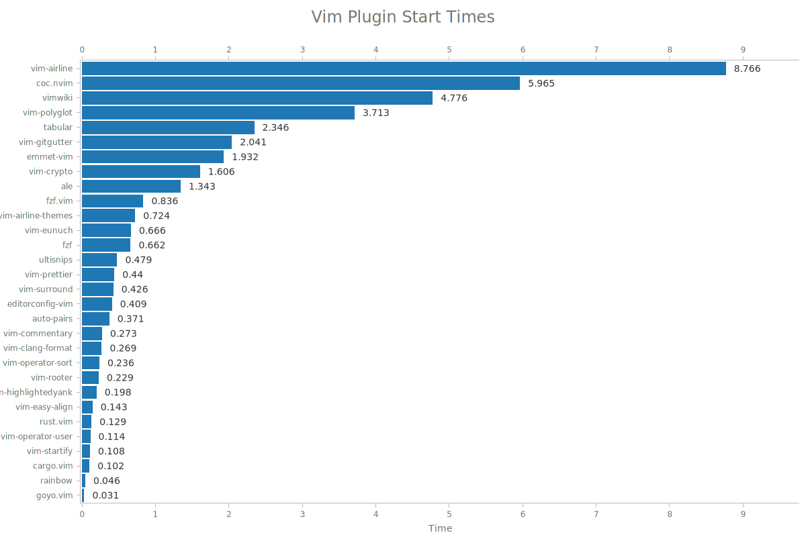

## vim-profiler 🕒

[](https://github.com/terror/zk/actions/workflows/build.yaml)

`vim-profiler` is a wrapper around the `(n)vim --startuptime` command, written in Rust. The binary is called
`vp` and has only been tested on a Unix based system.

### Demo

Here is a quick demo showcasing the main functionality of the program.

[](https://asciinema.org/a/ec3DhuwvAAoXCTs7pLdBG8JI6)

### Installation

You can install `vim-profiler` with the rust package manager Cargo:
```bash
$ cargo install vim-profiler
```

### Usage

```
vim-profiler 0.0.1
A vim profiling tool.

USAGE:
    vp [FLAGS] [OPTIONS]

FLAGS:
    -e, --export     Export the results to a CSV file
    -h, --help       Prints help information
    -p, --plot       Plot the data and save it to a SVG file
    -r, --reverse    Display the plugin times in reverse order (fastest first)
    -s, --sys        Show system plugins in the output
    -V, --version    Prints version information
    -v, --verbose    Add informative messages during program execution

OPTIONS:
    -c, --command <command>        The command to run, e.g vim or neovim [default: vim]
    -n, --count <count>            The number of plugins to list in the output
    -i, --iter <iter>              The number of iterations
    -x, --precision <precision>    Precision in the output
```

### Exporting results

This utility allows for exporting results to either in a `.svg` file in the form
of a plot or in a `.csv` file, where extra statistics are written.

#### Plot

The plot visualizes the start times of each plugin in your plugin directory. If
you invoke `vp` with the `--plot` flag, you will receive a plot in the form of
an SVG file called `plugins.svg` in the current working directory that looks
something like:



#### CSV

The CSV file contains various other useful statistics such as:
- The average start time across all iterations
- The median start time across all iterations
- The standard deviation from the mean

If you invoke `vp` with the `--export` flag you will receive a CSV file with
the additional statistics called `plugins.csv` in the current working directory
that looks something like:

|Plugin             |Average |Median  |Deviation|
|-------------------|--------|--------|---------|
|vim-airline        |9.92080 |9.46550 |1.13313  |
|coc.nvim           |7.41410 |6.90600 |1.49125  |
|vimwiki            |5.87170 |5.33350 |1.22342  |
|vim-polyglot       |4.29400 |3.96600 |0.96789  |
|tabular            |2.66950 |2.48300 |0.32859  |
|vim-gitgutter      |2.44260 |2.36200 |0.40292  |
|emmet-vim          |2.32240 |2.14300 |0.42288  |
|vim-crypto         |1.87450 |1.78100 |0.40047  |
|ale                |1.67460 |1.59300 |0.43811  |
|fzf.vim            |1.08730 |0.98550 |0.29802  |

### Prior Art

The API is heavily inspired by the Python script that goes by the same name
[vim-profiler](https://github.com/bchretien/vim-profiler).

A few other notable vim profiling tools include:
- [`hyiltiz/vim-plugins-profile`](https://github.com/hyiltiz/vim-plugins-profile)
- [`dstein64/vim-startuptime`](https://github.com/dstein64/vim-startuptime)
